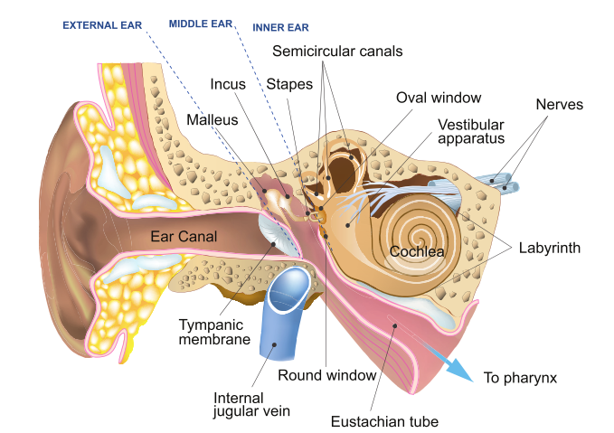
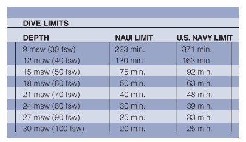
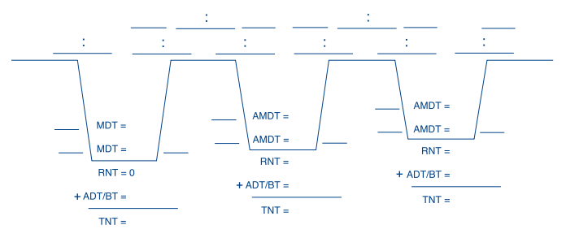

# Scuba Diving Notes
**Fall 2024 (Hart House Underwater Club)**
## Diving Science
### Physics
[TBA]
### Biology of Ears
Air spaces in body include lungs, sinuses, and middle ears. When you descend, pressure increases at a rate of 1 atm per 10m. If air space is closed off, surrounding pressure compresses the air. This can cause damage, known as **barotrauma.** The **block** is the oppositre, where air tries to expand as the diver ascends.

@@THM
Ear anatomy: Ears are divided into three sections, external, middle, and inner ear. The *middle ear* contains a series of three small bones that transmit sound waves from eardrum to inner ear, and has an airway linking it to the back of the throat, known as the **Eustachian tube.** Body balance mechanism is contained in inner ear.

@@

Middle ear squeeze occurs when air/water pressure in external ear is greater than the air pressure in middle ear. This can be equalized by moving air from throat to the middle ear via the Eustachian tube. This can be solved by pinching nose and attempting to breathe out through them, which opens up the valve to the Eustachian tube.

Middle ear blocks can also occur and are more rare. However, if it does happen, it can be solved by descending until it goes away, followed by swallowing and ascending slowly. If the block does not equalize and you must surface, close your nose and mouth and breathe in.

Sinus squeeze/blocks can occur if sinus is clogged. The effect of a squeeze can cause blood to flow into the sinus. This is very painful.
### Biology of Lungs
[TBA] but just remember to keep on breathing (golden rule!).
## Decompression, Dive Tables and Dive Computers
### Nitrogen and Diving
The air is 78% nitrogen. While oxygen in the air is used for metabolic purposes, the nitrogen dissolves in blood, and we need to be wary of its concentration. Your body *ingasses* nitrogen until the partial pressure of nitrogen in body is equal to the partial pressure of the air you breathe.

@@THM
As you spend time underwater, there are various effects that occur:
* Different tissues absorb nitrogen at different rates (muscle=quickly, fat=slowly)
* Nitrogen concentration goes higher as you spend time underwater (due to increased partial pressure)
* As you surface, nitrogen partial pressure is higher than that in air, so **offgassing** occurs
* Excess nitrogen passes from body tissues into blood, then into lungs, where it is exhaled. This process iniially occurs quickly but can take hours to return to normal.
@@

Because of the complex interactions, there are certain rules and tables divers must adhere to for safety. Or else risk **decompression sickness (DCS),** which occurs when a rapid change in pressure causes bubbles to form, damaging tissues. This can be mitigated by controlling dive time and depth.

Some factors that can increase changes of DCS include dehydration, fatigue, injuries, intensive activity during/after the dive, obesity, or advanced age. In general, DCS is not likely to occur if you dive to depths of *6.4 meters or less.* For depths higher than that, refer to the above table. **NAUI Open Water Divcers should not dive to depths deeper than 18 meters.** The maximum recommended depth for all recreational divers is 40 meters (130 feet).

@@THM
**Residual nitrogen** could be left from previous dives if multiple dives are scheduled within the same day. This is because it takes hours to fully absorb or eliminate nitrogen to and from the body.
@@

### Dive Table
Dive tables are used to determine the maximum depth and time for a dive.

@@DEF
**Letter Groups:** The amount of residual nitrogen in your body is labelled from A (low) to N (high).
@@
Some other key terms
* **Dive Schedule** = Gives the depth/time of the dive (i.e. 70 feet/40 m)
* **Maximum Dive Time (MDT)** = Max time at a given depth without having to do a required decompression stop during ascent
* **Decompression Stop** = Point in a dive where you stop at a specified depth for a specified time during ascent to allow nitrogen offgassing
    * **Precautionary Decompression Stop**: Stop at 5 meters for 3 minutes as a precaution if MDT is not exceeded. Should be done all the time. Known as *safety stop.*
    * **Required Decompression Stop**: If MDT is exceeded, this is the time you must spend at five meters given by dive tables.
* **Actual Dive Time (ADT)**: elapsed time from moment of descent until arriving at the safety stop
* **Surface Interval Time (SIT)**: Time spent on surface between dives
* **Repetitive Dive**: Any dive made less than 24h after a previous dive
* **Residual Nitrogen Time (RNT)**: Amount of time you must consider as already having been spent at a given depth for a planned repetitive dive.
* **Adjusted Maximum Dive Time (AMDT)**: $AMDT=MDT-RNT$
* **Total Nitrogen Time (TNT)**: $TNT = RNT + ADT$. Use this to obtain new Letter Group at the end of the dive.

Dive table rules:
* Ascend no faster than 9m/min
* Dive schedule is determined using the deepest depth
* Do deepest dive first in a series of dives
* Any dive shallower than 6m to be a 6m dive.
* $SIT_\text{min}=10\text{ min}$ and $SIT_\text{recommended}=60\text{ min}.$
* Use the next greater dive time if your dive is particularly code or streneous.

The NAUI Dive Tables are designed to flow from one table to the next in a continuous loop. See below:

### Dive Planning Worksheet
You will need to know how to fill out something like this:

Consider the following situation:
1. Dive 1 Planning:: We plan on diving 21 meters.
2. Dive 1 Actual: Actual depth was 20 meters. Descent started at 9:45am and surfaced at 10:20am (32 minutes).
3. Rest: We had a picnic for 2 hours.
4. Dive 2 Planning: We plan on diving to 15 meters.
5. Dive 2 Actual: Actual depth was 16 meters. Dive started at 12:35pm and surfaced at 12:58pm.

Here is what the dive table should look like:

Refer to pages 121-123 of the textbook for an in-depth explanation.
### Special Rules
**Omitted Decompression:** If you surface and discover you omitted a required decompression stop, take the following steps:
1. Discontinue diving for 24 hours no matter how well you feel.
2. Breathe 100% oxygen, if available.
3. Drink plenty of fluids.
4. Rest.
5. Watch for symptoms of DCS.

**Flying after Diving:** Commercial aircraft pressure cabins to 0.75ATM. NAUI recommendation is to wait 24h after the completion of your last dive before flying or ascending altitude.

**Altitude Diving:** If the water is at different altitudes, different rules need to be followed.
### Dive Computers
[TBA]